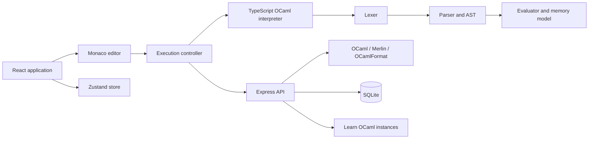

# Caraml architecture

Caraml is a full-stack OCaml development environment with two complementary execution paths. The browser path keeps the application immediately usable; the native path adds the official OCaml toolchain in trusted or sandboxed environments.

## Browser interpreter

The interpreter under `src/interpreter/` is implemented specifically for Caraml:

1. `lexer.ts` converts OCaml source into position-aware tokens.
2. `parser.ts` builds an AST for expressions, declarations, patterns, records, arrays, references, exceptions, and control flow.
3. `evaluator.ts` evaluates closures in lexical environments and maintains a pedagogical stack, heap, and type-definition view.
4. `display.ts` formats runtime values using OCaml-like notation.

Execution is bounded by a step limit, a wall-clock limit, and a configurable recursion depth. Errors are returned as structured editor diagnostics rather than thrown through the React tree.

## Native toolchain

The Express backend discovers a local or opam-managed OCaml toolchain and exposes bounded endpoints for evaluation, completion, type inspection, diagnostics, and formatting. Every request uses rate limits and timeouts.

Native execution is disabled by default in production. Operators must opt in with `CARAML_ENABLE_NATIVE_EXECUTION=1` and should only do so when the complete server runs inside a hardened sandbox with filesystem, network, CPU, and memory restrictions. User programs receive a minimal environment that excludes application secrets.

## Persistence and sharing

SQLite stores users and multi-file projects. JWT authentication protects private project routes. A project owner can create a public, unguessable share identifier; visitors may inspect a shared project and authenticated users may fork it.

The guest playground is entirely client-side. It persists only in local browser storage and never requires an account or backend write.

## Learn OCaml

Caraml can connect to an existing Learn OCaml server, list exercises, synchronize answers, and render grading reports. Where supported, grading runs in a sandboxed Web Worker in the browser; server routes provide compatibility fallbacks.

## Production boundaries

- The Docker image runs as a non-root user.
- `JWT_SECRET` is required for stable production sessions.
- SQLite storage is configured through `CARAML_DB_PATH`.
- Native OCaml execution is off by default in production.
- CORS is restricted to same-origin, local development, and explicit allow-listed origins.
- Code payloads, process duration, and anonymous request rates are bounded.
