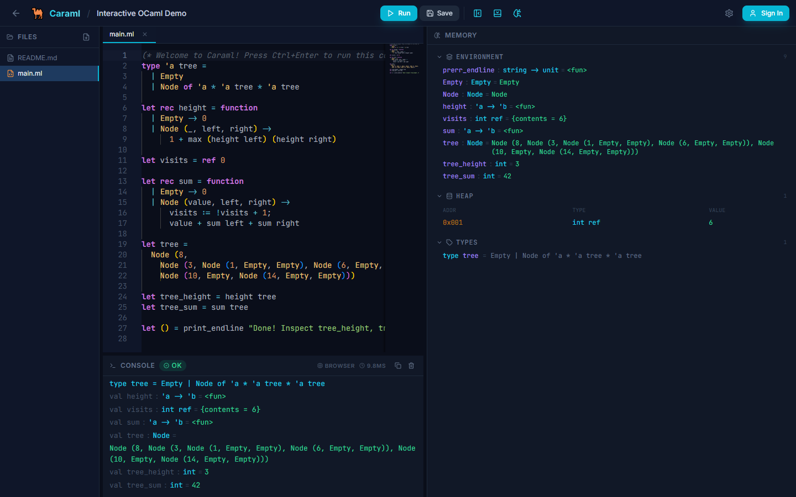
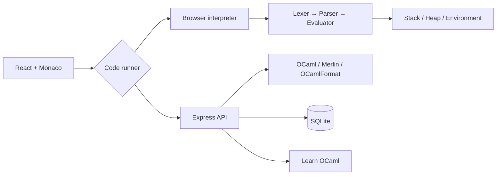

<div align="center">

# 🐫 Caraml

### A full-stack OCaml IDE that runs in your browser

Write, run, inspect, learn, and share OCaml code with a custom TypeScript interpreter, Monaco Editor, memory visualization, and optional native tooling.

[](https://github.com/LucideAI/Caraml/actions/workflows/ci.yml)
[](https://github.com/LucideAI/Caraml/releases)
[](LICENSE)
[](package.json)

**[Live browser demo](https://lucideai.github.io/Caraml/)** · **[Architecture](ARCHITECTURE.md)** · **[Contributing](CONTRIBUTING.md)**

</div>



## Why Caraml stands out

- **Interpreter engineering:** a purpose-built OCaml lexer, parser, AST evaluator, standard-library subset, and structured diagnostics written in TypeScript.
- **Two execution modes:** instant browser execution everywhere, plus official OCaml, Merlin, and OCamlFormat tooling when a trusted backend is available.
- **Runtime visibility:** inspect lexical environments, stack frames, heap objects, references, arrays, and user-defined types after execution.
- **Complete product workflow:** authentication, multi-file projects, autosave, public sharing, forking, responsive layouts, and persisted preferences.
- **Learning integration:** connect to Learn OCaml instances, browse exercises, synchronize answers, and render grading reports.
- **Zero-friction demo:** visitors can open a seeded project, edit it, run it, and save it locally without creating an account.

## Architecture at a glance



Read the detailed design and production boundaries in [ARCHITECTURE.md](ARCHITECTURE.md).

## Quick start

Requirements: Node.js 20.19+ (or 22.12+) and npm. OCaml is optional because Caraml includes its own browser interpreter.

```bash
git clone https://github.com/LucideAI/Caraml.git
cd Caraml
npm install
npm run dev:no-ocaml
```

Open `http://localhost:5173`, then select **Try Live Demo**.

The hosted [GitHub Pages demo](https://lucideai.github.io/Caraml/) is browser-only: execution and local saving work without an account, while authentication and sharing are available in a self-hosted full-stack deployment.

For the full local OCaml toolchain:

```bash
npm run setup:ocaml
npm run dev
```

The setup script creates a repository-local opam switch and installs pinned OCaml, Merlin, and OCamlFormat versions. If setup is unavailable, Caraml degrades gracefully to browser execution.

## Quality checks

```bash
npm run typecheck
npm test
npm run build

# Or run the complete local gate
npm run check
```

The CI matrix validates Node.js 20 and 22 on Linux and Windows.

## Docker deployment

```bash
cp .env.example .env
# Set a strong JWT_SECRET in .env
docker compose up --build
```

The production container runs as a non-root user, persists SQLite under `/data`, and keeps native OCaml execution disabled. Browser execution remains fully available.

## Technology

| Area | Stack |
| --- | --- |
| Frontend | React, TypeScript, Vite, Zustand, Tailwind CSS |
| Editor | Monaco Editor, custom OCaml language services |
| Interpreter | Custom lexer, parser, evaluator, runtime and memory model |
| Backend | Node.js, Express, SQLite, JWT, bcrypt |
| OCaml tooling | OCaml, Merlin, OCamlFormat, opam |
| Quality | Vitest, GitHub Actions, Dependabot, Docker |

## Configuration

| Variable | Purpose | Default |
| --- | --- | --- |
| `JWT_SECRET` | Signs authentication tokens; required for stable production sessions | Ephemeral in production |
| `PORT` / `CARAML_API_PORT` | Express API and production web port | `3001` |
| `CARAML_DB_PATH` | SQLite database location | `./caraml.db` |
| `CARAML_ALLOWED_ORIGINS` | Additional comma-separated CORS origins | None |
| `CARAML_ENABLE_NATIVE_EXECUTION` | Explicitly enables native tools in production | `0` |
| `CARAML_MAX_CODE_BYTES` | Maximum submitted source size | `100000` |
| `CARAML_OCAML_PATH` | Explicit OCaml executable | Auto-detected |
| `CARAML_OCAMLMERLIN_PATH` | Explicit Merlin executable | Auto-detected |
| `CARAML_OCAMLFORMAT_PATH` | Explicit OCamlFormat executable | Auto-detected |

See [.env.example](.env.example) for a production-oriented template.

## Keyboard shortcuts

| Shortcut | Action |
| --- | --- |
| `Ctrl/Cmd + Enter` | Run the active OCaml file |
| `Ctrl/Cmd + S` | Save the project or browser-local demo |
| `Ctrl/Cmd + Shift + F` | Format with OCamlFormat when available |
| `Ctrl/Cmd + Shift + G` | Submit a Learn OCaml exercise |

## API surface

The Express API covers authentication, projects, sharing, native tooling capabilities, execution, Merlin services, formatting, and Learn OCaml synchronization. See [ARCHITECTURE.md](ARCHITECTURE.md) for trust boundaries and [SECURITY.md](SECURITY.md) before enabling native execution publicly.

## License

Caraml is available under the [MIT License](LICENSE).
